# 📊 Diagramas & Visualizações

Representações visuais da arquitetura, fluxos e estruturas do projeto.

---

## 🏗️ Arquitetura Geral

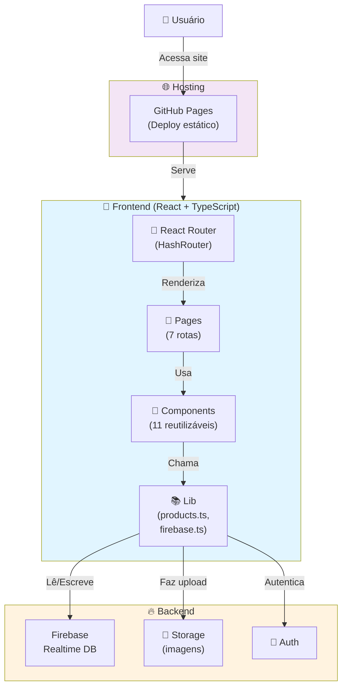

---

## 🛣️ Mapa de Rotas

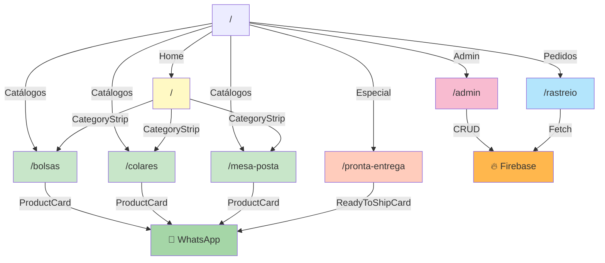

---

## 🎯 Estrutura de Componentes (Hierarquia)

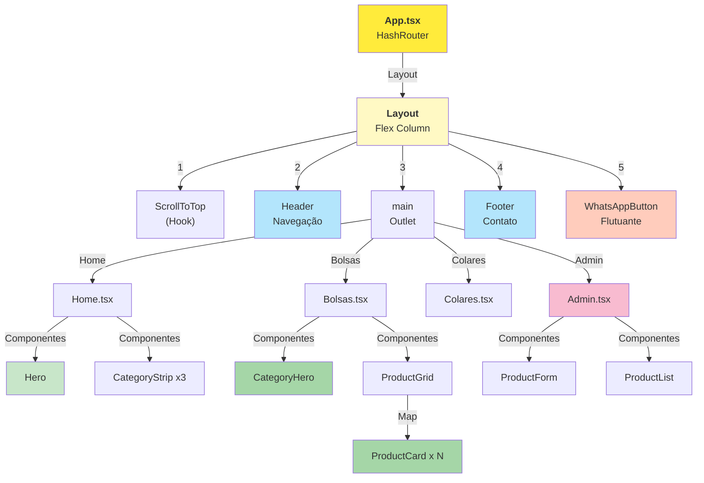

---

## 🔄 Fluxo: Visualizar Catálogo

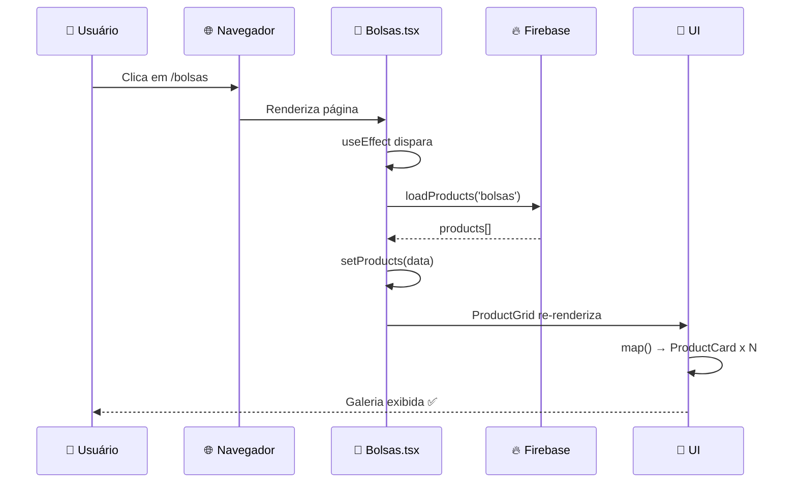

---

## 🛍️ Fluxo: Fazer Pedido (WhatsApp)

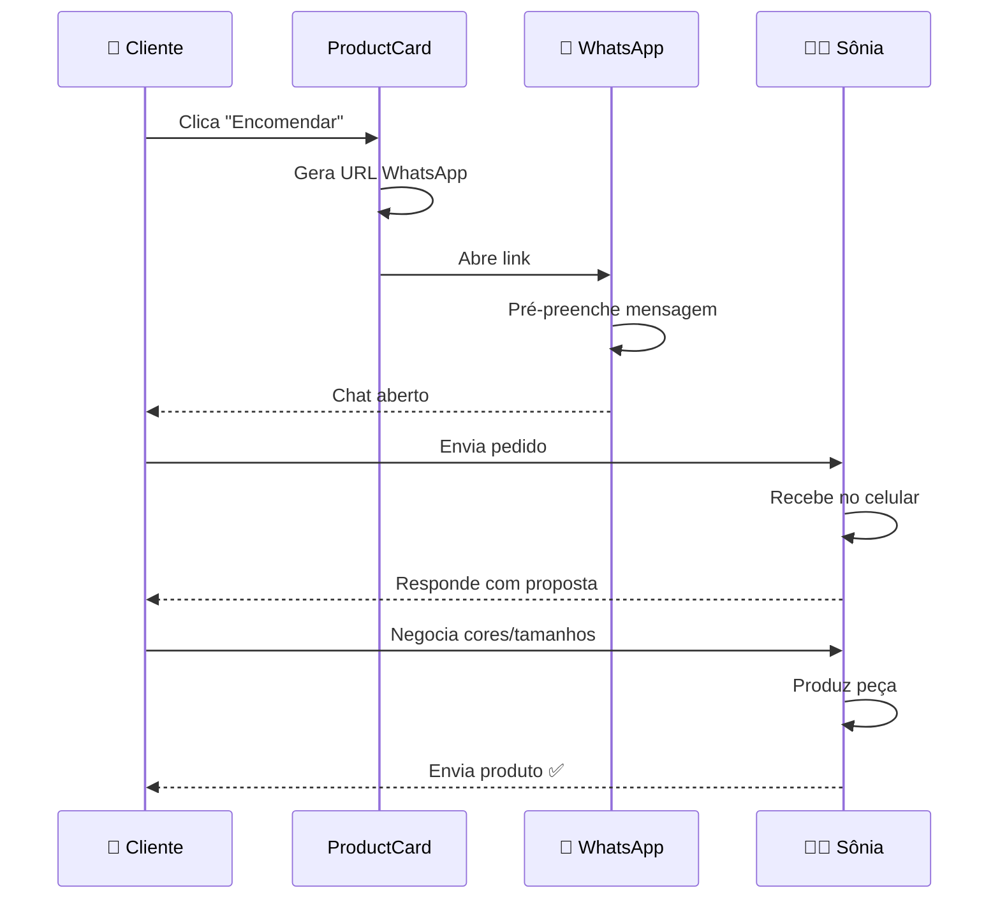

---

## 📊 Fluxo: Admin (CRUD de Produtos)

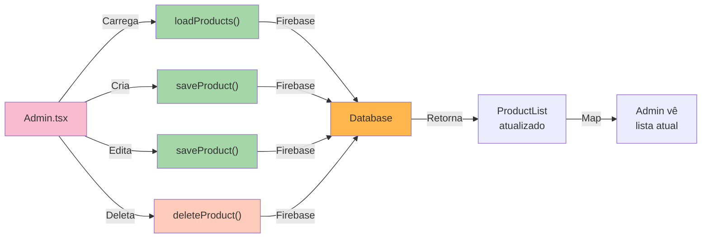

---

## 🧬 Modelo de Dados: Product

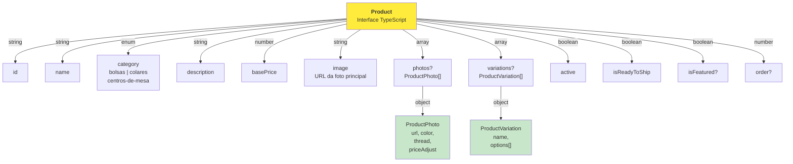

---

## 📦 Modelo de Dados: Order

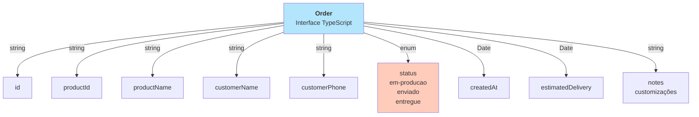

---

## 🎨 Design System (Cores)

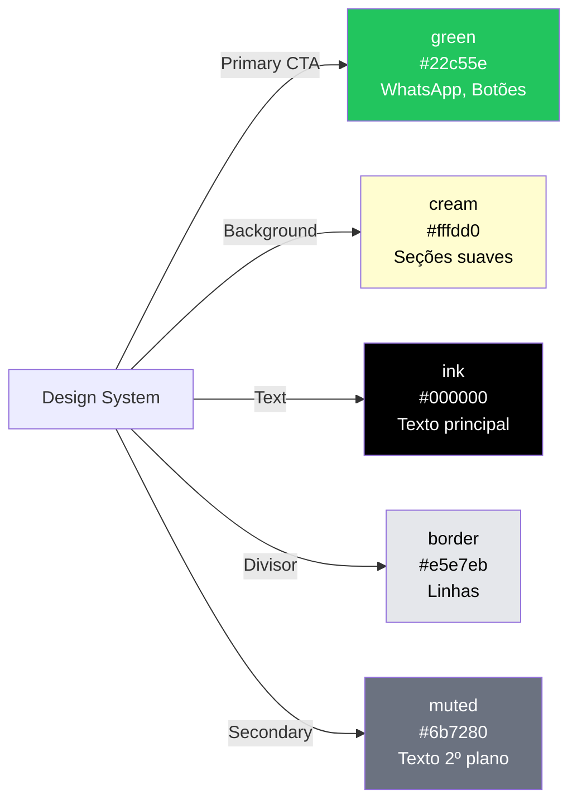

---

## 🔗 Dependências de Componentes

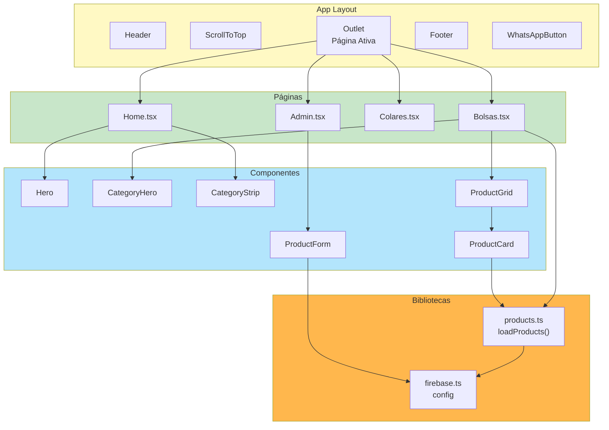

---

## 📈 Fluxo de Dados Completo

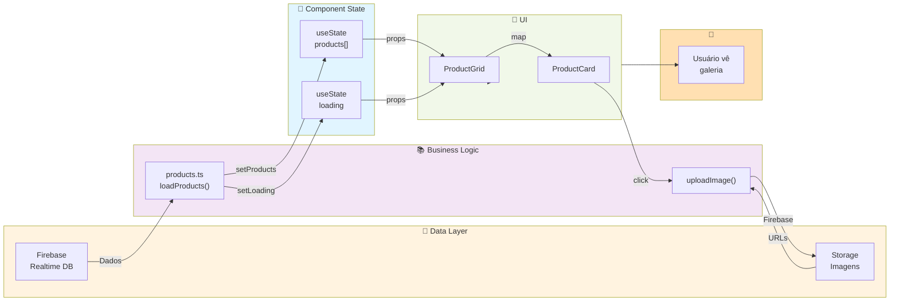

---

## 🎯 Jornada do Usuário

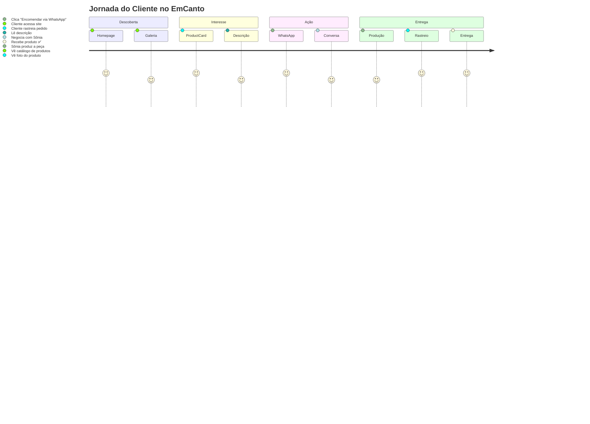

---

## 📱 Responsividade (Mobile-First)

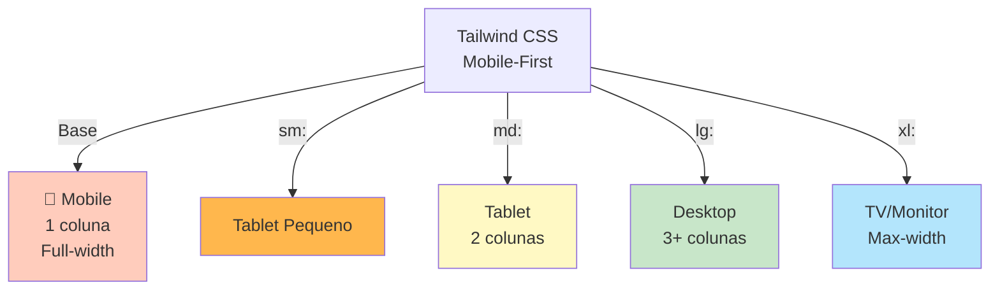

---

## 🚀 Pipeline de Deploy

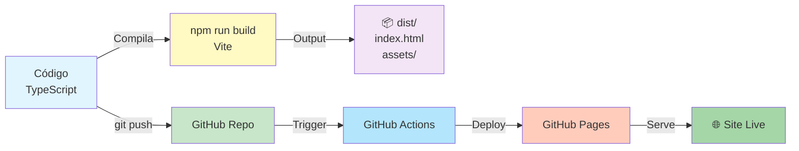

---

## 🎓 Como Usar Estes Diagramas

### No Obsidian
1. Abra qualquer arquivo deste vault
2. Procure por blocos `mermaid`
3. Clique na aba "Preview" para ver renderizado
4. Clique em ícone "expand" para ver em tela cheia

### No Código
- Copie o código mermaid
- Cole em ferramentas como [mermaid.live](https://mermaid.live)
- Exporte como PNG/SVG

### Para Onboarding
- Mostre aos novos devs esses diagramas
- Ajudam a entender arquitetura rapidamente
- Melhor que mil palavras!

---

_Diagramas gerados com Mermaid • EmCantoArtesanato_
